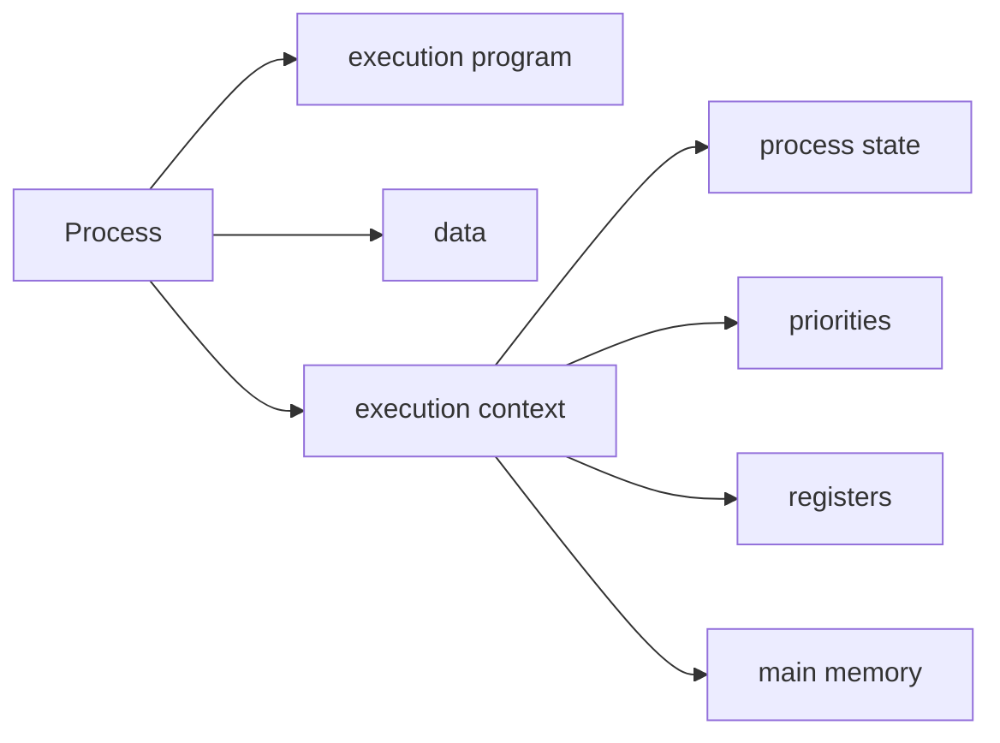

# Process Management
A process is a program in execution

#### OS
- proc creation
- proc deletion
- proc scheduling

#### Process

#### possible errors
1) improper sync (i.e. Therac)
2) failed mutual exclusion (i.e. Mars Pathfinder)
3) non-deterministic program execution
4) dead locks

non-deterministic example:
x=3
P1 -> x=x+1
P2 -> x=3x
possible answers: {4, 9, 10, 12}

P1
R1 = x
R1 = R1 + 1
X = R1

P2
R2 = x
R2 = R2 * x
x = R2

Time|P1|P2
---|---|---
1|R1=3|
2|R1=3+1=4|
3||R2=3
4|X=4|
5||R2=3 * 3=9
6||X=9

