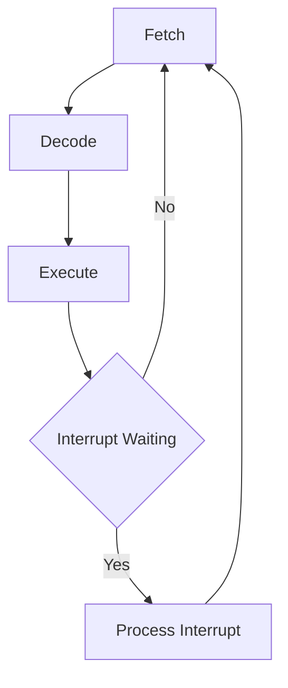
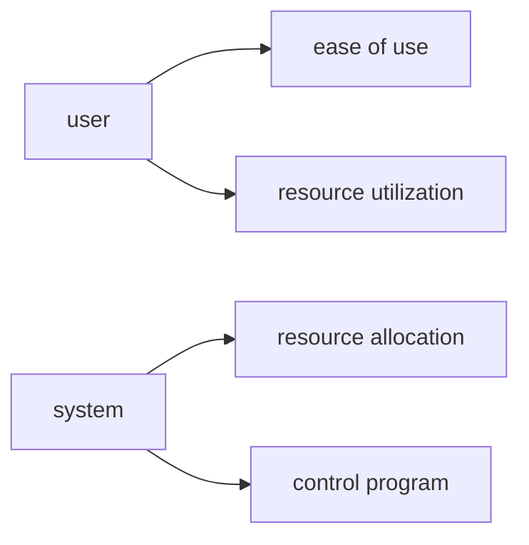

*understanding the services offered by the OS will influence how you design applications*

## Computer basic elements
- Processor(s)
- Main Memory
- I/O modules
- interconnect (bus)

_OS's are typically event(interrupt) driven_

## Fetch-decode-execute instruction cycle



## Main Memory (RAM)
memory hierarchy
1) Registers
2) Cache
3) RAM
4) Disk Cache/hard drive
5) Off-board (i.e. usb)

$$ Effective Access Time = H*L1 + (1-H)*L2 $$

### example
|cache|size|cost|
|---|---|---|
|L1|1000 bytes| 0.1 μs|
|L2|100,000 bytes|1.0 μs|
_hitrate (H) = 90%_

$$ Effective Access Time = (.9)(.1μs)+(.1)(1.0μs) = .19 μs $$

### Principal of Locality (Locality of Reference)
Memory references tend to cluster

### Cache mapping schemes
#### Direct mapped
```plantuml
left to right direction

object "Main Memory" as mm {
	0x00
	----
	0x01
	====
	0x04
	----
	0x05
	====
	0x08
	----
	0x09
	----
	...
}

object "Cache" as c {
	0x00
	----
	0x01
	----
	...
}

mm::0x00 --> c::0x00
mm::0x04 --> c::0x00
mm::0x08 --> c::0x00

mm::0x01 --> c::0x01
mm::0x05 --> c::0x01
mm::0x09 --> c::0x01

```
- better structured approach (index by function)
- can have contention (cache blocks constantly being evicted due to repeated same modulus)


- need a mapping function
- schemes
	- Direct Mapped (modulus mapped)
		- mem blocks, 0, 4, 8,... -> cache block 0
		- mem blocks, 1, 5, 9,... -> cache block 1
		- can have contention (cache blocks constantly being evicted due to repeated same modulus)
		- better structured approach (index by function)
	- Fully Associative
		- put a memory block anywhere in cache
		- requires searching cache to find data/instruction
		- *special cache* (associative) for parallel search for searching
		- built in hardware (bigger cache -> more logic gates)
		- requires a replacement algorithm (usually FIFO)
	- Set Associative
		- group cache blocks into sets of cache blocks
		- direct map to get correct set
		- associative map to get block within set
		- requires only the hardware to search length of set, not entire cache (i.e. 4x4 grid: 4 sets of 4 blocks each)
	- use address to determine location in cache
		- must know
			1) cache size (sets, blocks)
			2) block size
			3) main memory size
		- example
			- memory = 32 blocks
			- block = 4-units
			- 4 bytes per block
			- 7bit address
			  $$2^5 * 2^2 = 2^7 bytes$$
			- cache = 4 blocks @ 4 bytes each
			- Addresses
			  address|mem|cache
			  :---|---:
			  0-3|0|0
			  4-7|1|1
			  8-B|2|2
			  C-F|3|3
			  10-13|4|0
			- Direct Mapped
				- convert address to binary
				- split into 3 fields [tag|block|offset]
				- bits: [tag:3:leftover|block:2:cache size|offset:2:cache block size]
				- ex: address 0xC
					- binary: 0001100
					- [000|11|00]
					- block: go to cache block (3)
						- if miss: go to memory and bring block into cache, store tag(for checking if which mem block is in cache block, stored alongside cache (not with data))
				- ex2: 0xD
					- 0001101
					- [000|11|01]
					- block: go to cache block 3
						- hit: go to cache block offset 1
				- ex3: 0x1F
					- [000|11|11]
					- block 3
						- miss: bring into block 3

#### Large example (direct map)
mm: 32k
cache 512bytes
block: 8bytes
$$block size: 8=2^3$$
$$blocks: 2^9 - 2^3 = 2^6$$
$$memory:2^5 * 2^10 = 2^15$$
[tag:6|block:6|offset:3] (15 total)

### Full Assoc example
Main memory: 16 slots (8 blocks of 2 slots) (4bit address)
```
[,|,|I,J|,|G,H|,|K,L|,]

[tag:3|offset:1]
0x9: [100|1] miss
0x5: [010|1] miss
0xD: [110|1] miss
0x8: [100|0] hit (0x9)
```

cache:
[G,H|I,J|K,L|,]

### Set Assoc Example (N-way set assoc)
n is number of blocks per set

#### 2-way
- 32k mem -> 2^15 = 15bit address
- 512 byte cache -> 2^9/2^3=2^6 blocks (6bits to count)
- 8 byte block -> 2^3 bits offset
draw as a 32r x 2c table (sets x blocks per set)

[tag:7|set:5|offset:3]

memory map -> (set, block)
1) 0x01: [000000|00000|001] -> (0, a)
2) 0x404: [000010|00000|101] -> (0, b) (search set 0, look for block with tag 000010, not found so pick next)
3) if next address hits set (not 0x01 or 0x404), evict one (probably a because of FIFO)

#### sequence
1) go to set(middle field)
2) walk set to find a matching tag
3) get data using offset

EAT example:
- L1: 10ns (90% hitrate)
- L2: 20ns (95% hr)
- mem: 100ns (100% hr)

serial/sequential access: check each level sequentially
overlap/parallel: check all storage level at the same time

assume:
1) caches overlap
2) if miss, restart (bring to cache and access)
3) access time includes retrieve and update cache(s)

ex1: L1 & memory: 20ns average
$$ EAT = 0.9(10ns)+.1(100ns + 10ns) = 20ns$$
if no overlap (add L1 miss):
$$ EAT = 0.9(10ns)+.1(10ns + 100ns + 10ns) $$
 ex2: L2 & memory (overlap and restart)
 $$ EAT = 0.95(20ns)+.05(100ns + 20ns) $$
 ex3: L1, L2 & memory (L1 hit + L1miss[L2hit+L2miss])
 $$ EAT = 0.9(10ns)+.1[0.95(20ns)+0.05(100ns+10ns)] $$

## OS Major Tasks



## Tasks
1) [Process management](1.1_ProcessManagement)
2) [Memory management](1.2_MemoryManagement)
3) [I/O](1.3_IO)
4) Protection & Security

### Multi-terms
1) multiprogramming (process 1+ programs (many users) concurrently)
2) multitasking (1+ tasks per user)
3) multithreading (divide a program into threads)
4) multiprocessing (1+ processors/cpu)
5) multicore (1+ cpu on the same chip)
