# 2022-09-15
## Flynn's Taxonomy

```mermaid
flowchart TB

	a[all]
	
	a --> sisd
	a --> simd
	a --> misd
	a --> mimd

	sisd --> vn[Von Neumann]
	simd --> vector --> cray([i.e. Cray])
	simd --> parallel --> cnxn([i.e. Connection Machine])
	misd --> q[?]
	mimd --> sm[Shared Memory] --> tc([tightly coupled])
	mimd --> pm[Private Memory] --> lc([loosely coupled])
```

- SISD: single instruction, single data
- SIMD: single instruction, multiple data
- MISD: multiple instruction, single data
- MIMD: multiple instruction multiple data

### Test 1 ends here
---
