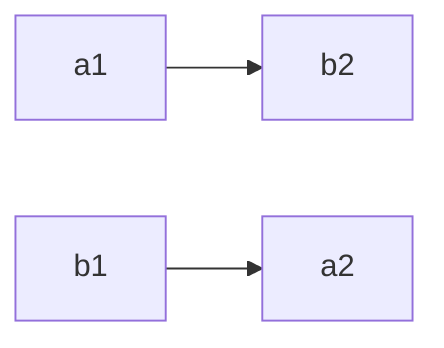

suppose:
|P1||P2|
|---|---|
|a1|b1|
|a2|b2|

Sync processes such that


```c
semaphore A,B = 0;
void p1() {
	a1();
	signal(A);
	wait(B);
	a2();
}

void p2() {
	b1();
	signal(B);
	wait(A);
	b2();
}
```

deadlock: when a process is holding a resource (semaphore) and waiting for another resource.

# Dining Savages problem
## idea
- communal dinner
- large pot of food
- eat -> go help yourself
- if pot is empty, wake up cook

```c
semaphore emptypot = 0;
semaphore fullpot = 0;
semaphore mutex = 1;
int servings = 0;

const int MAX_SERVINGS = 10;

void savage(int n) {
	while (true) {
		wait(mutex);
			if (servings == 0) {
				signal(emptypot);
				wait(fullpot);
				servings = MAX_SERVINGS;
			}
			servings--;
		signal(mutex);
		// eat
		cout << "savage " << n << " is eating..." << endl;
	}
}

void cook() {
	while (true) {
		wait(emptypot);
		// fill pot;
		cout << "cook fills the pot" << endl;
		signal(fullpot);
	}
}

main() {
	cobegin {
		savage(1);
		savage(2);
		savage(3);
	}
}

```

# sushi bar
- bar with 5 seats
- if empty seat, you sit
- if all 5 seats are full -> wait for all 5 to leave
```c
semaphore mutex;
semaphore block;

int eating = 0;
int waiting = 0;
int n;

void person(int i) {
	wait(mutex);
	if (eating == 5) {
		waiting++;
		signal(mutex);
		wait(block);
		
		wait(mutex);
		waiting--;
	}
	eating++;
	signal(mutex);
	// eat
	cout << "person " << i << " is eating sushi..." << endl;

	wait(mutex);
		eating--;
		if (eating == 0 && waiting > 0) {
			n = min(5, waiting);
			signal(block);
		}
	signal(mutex);
}

main() {
	initialsem(mutex, 1);
	initialsem(block, 0);
}
```

issue: 6 can be eating
1) 5 eating
2) 6th customer blocks on `wait(block)`
3) due to scheduling, sushi bar empties and 5 more enter, but 6 is signalled
4) 6th customer will now:
	1) `waiting--`
	2) `eating++`
	3) `signal(mutex)`

# Cigarette smokers problem
- 4 processes
	- tobacco
	- paper
	- matches
	- agent
- smoker processes (tobacco, paper, matches)
- agent randomly generates 2 smoker processes
- smoker process that completes set with 2 on the table will then run
key is to have the agent determine what is missing and wake up appropriate process

# group print
```
semaphore s3;

void process1() {
	while (1) {
		wait(s3);
		cout << "w";
		signal(s2);
	}
}

void process2() {
	while (1) {
		wait(s1);
		cout << "o";
		signal(s3);
	}
}

void process3() {
	while (1) {
		wait(s2);
		cout << "c";
		signal(s1);
	}
}

main() {
	// print cowcowcow...
	initialsem(s1, 0);
	initialsem(s2, 1);
	initialsem(s3, 0);

	// can (2,2,2) print wowccow? yes

	// can (2,2,2) print wcowwcco...? 
	231
	121
	022
	031
	040
	130
	220
	121

	cobegin {
		process1();
		process(2);
		process(3);
	}
}
```