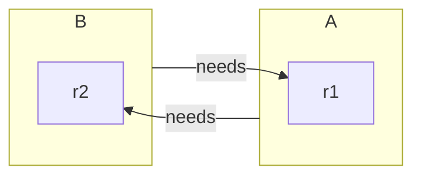
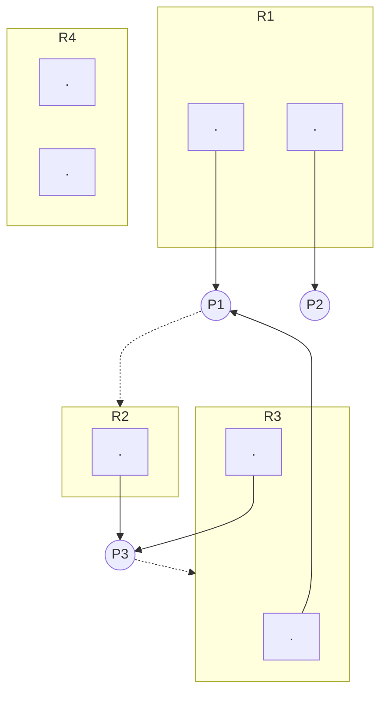

# Deadlock
when 2 processes block waiting on the resource the other process has

## Resources

### categories
1) reusable
2) consumable
### modes
1) preemtable - can be removed with no ill effects
2) nonpreemtable

## Methods for Handling Deadlock
0) Ignore it
1) Never let system enter a DL state
	1) prevention
	2) avoidance
2) Recover from deadlock

### Conditions
1) mutual exclusion
2) hold and wait
3) no preemption
4) circlular wait - circle of processes waiting on a resource held by the next process in the chain
_1-3 are necessary, but not sufficient_
_all 4 are necessary and sufficient_

### Resource Allocation Graph
- set of vertices
	- processes (circle)
	- resources (box with dots per instances of resource)
- set of edges (allocations or requests)
	- Pi -> Rj (Pi requesting Rj: circle to box)
	- Ri -> Pj (Ri has been allocated to Pj: dot to circle)

### Deadlock Prevention
_prevent (at least) 1 of 4 conditions happening_
1) ME: not feasible
2) Hold & Wait
	- request all or none
	- time limit on hold time
	- request resource when have none
3) no preemption
	- works for "naturally preemptable" resources
4) circular wait
	- impose total linear order on all resources & require processes to request resources in this total order

### Deadlock avoidance
- allows 1st 3 conditions to happen
- avoids DL by restraining how requests are allocated
- dynamically examine the **state** to ensure no circular wait

#### Safe state
a state is safe if there exists at least one squence in which all processes cna run to completion assuming the worst case

#### example: [P0,P1,P2; R1:13]
- P0: needs max 10; has 5
- P1: needs max 4; has 2
- P2: needs max 9; has 2

_If P0 requests 3, we can calculate no safe sequence, so the request is denied and P0 is told to wait_
1) P1: get 2, run, and release [R1:5]
2) P0: get 5, run, and release [R1:10]
3) P2: Run

- safe sequence ==> no deadlock (safe state)
- unsafe state =/=> deadlock (there is potential for deadlock)
