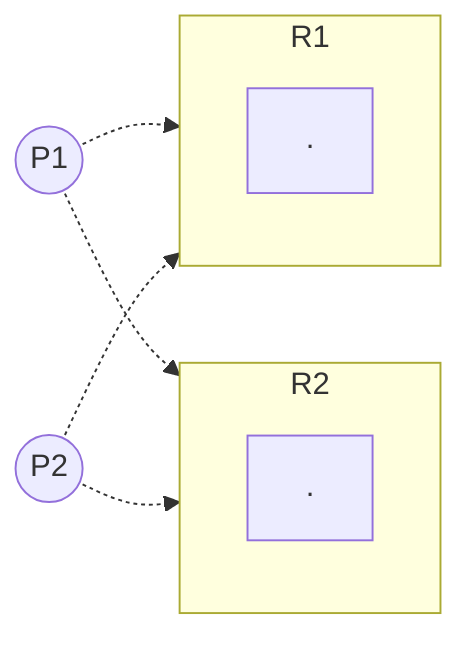
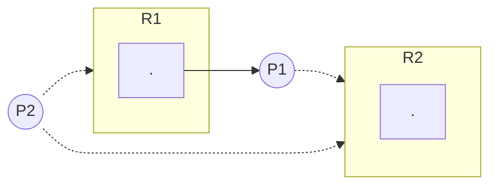
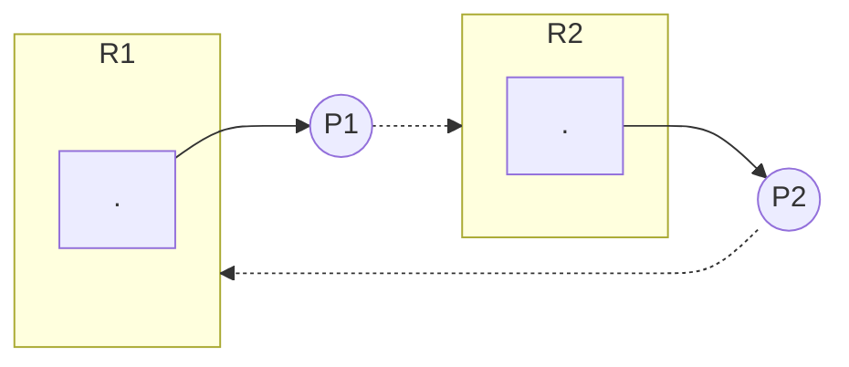

# Exam 2: Thursday, Nov 3

# Deadlock Avoidance (cont)

## Algorithm 1
**Resouce Allocation Graph Algorithm for DL Avoidance**

- only good for "single instance" model
- add "claim" endges to RAG (denoted ---->)
	- Pi ---> Rj means Pi may request for Rj at some time in the future
	- Pi -> Rj (solid line) means Pi makes request for Rj
	- Pi releases Rj: Pi ----> Rj
whenever Pi requests Rj, the request can be granted only if converting the request edge Pi -> Rj to an allocation edge Rj -> Pi does not form a cycle in the RAG

grant R1 to P1

grant R2 to P2

now we ahve a deadlock, so we should not allow this

## Bankers Algorithm
**Dijkstra**

#### requires data structures
1) Resource = (R1, R2, R3, ..., Rm) | Ri is the total number of instances of Ri
2) Available = (V1, V2, V3, ..., Vm) | Vi is the total available of Ri
3) Max = [M(i x j) matrix] | Mij = max required of Pi for Rj
4) Alloc = [A(i x j) matrix] | Aij = current allocation of Rj for Pi
#### note
Ri = Vi + sum(from k=1 to n, Aki)
$$Ri = \sum_{k=1}^n A_{ki}$$
$$M_{ki} \le R_i | \forall{ki}$$
$$A_{ki} \le M_{ki} | \forall{ki}$$

#### example
- 4 processes
- 3 resources
- R = (9,3,6)
- Avail = (0,1,1)
|Max|R1|R2|R3|
|---|---|---|---|
|P1|3|2|2|
|P2|6|1|3|
|P3|3|1|4|
|P4|4|2|2|

|Alloc|R1|R2|R3|
|---|---|---|---|
|P1|1|0|0|
|P2|6|1|2|
|P3|2|1|1|
|P4|0|0|2|

|Need|R1|R2|R3|
|---|---|---|---|
|P1|2|2|2|
|P2|0|0|1|
|P3|1|0|3|
|P4|4|2|0|

1) start with avail
2) pick any process and add alloc
3) if sum is within R, proceed

#### example
|max|R1|R2|R3|R4|alloc|R1|R2|R3|R4|need|R1|R2|R3|R4|
|---|---|---|---|---|---|---|---|---|---|---|---|---|---|---|
|P0|0|0|1|2||0|0|1|2||0|0|0|0|
|P1|1|7|5|0||1|0|0|0||0|7|5|0|
|P2|2|3|5|6||1|3|5|4||1|0|0|2|
|P3|0|6|5|2||0|6|3|2||0|0|2|0|
|P4|0|6|5|6||0|0|1|4||0|6|3|2|

avail = (1,5,2,0)
R=(3,14,12,12)
one solution: P0->P2->P1->P3->P4

suppose P2 reqs <0,4,2,0>
P2(alloc) = 1|4|2|0
|max|R1|R2|R3|R4|alloc|R1|R2|R3|R4|need|R1|R2|R3|R4|
|---|---|---|---|---|---|---|---|---|---|---|---|---|---|---|
|P0|0|0|1|2||0|0|1|2||0|0|0|0|
|P1|1|7|5|0||1|4|2|0||0|3|3|0|
|P2|2|3|5|6||1|3|5|4||1|0|0|2|
|P3|0|6|5|2||0|6|3|2||0|0|2|0|
|P4|0|6|5|6||0|0|1|4||0|6|3|2|
avail = (1,1,0,0)

|avail||||run after calc|
|---|---|---|---|---|
|1|1|0|0|P0|
|1|1|1|2|P2|
|2|4|6|6|P1|
|3|8|8|6|P_any|

## Deadlock Detection
- use alloc matrix and avail vector
- add req matrix Q where
	- Qij represents the number of resources of type j requested by Pi

### algorithm
1) if Pi's row in alloc all zeros mark Pi
2) w <- Avail
3) for any unmarked row ri in in Q find such that row <= w
4) if found mark Pi and add Pi's alloc to W: `goto 3`
5) if not found, halt
Deadlock if any unmarked processes

#### example
|Alloc|R1|R2|R3|R4|R5|req|R1|R2|R3|R4|R5|
|---|---|---|---|---|---|---|---|---|---|---|---|
|P1|1|0|1|1|0||0|1|0|0|1|
|P2|1|1|0|0|0||0|0|1|0|1|
|P3|0|0|0|1|0||0|0|0|0|1|
|P4|0|0|0|0|0||1|0|1|0|1|

avail(w)
|R|to run|marked|
|---|---|---|
|00001||P4|
|00001|P3|P3,P4|
|00011|deadlock|P3, P4|
deadlock because P1 & P2 contend over R{2,3}

---
# Exam 2
---
