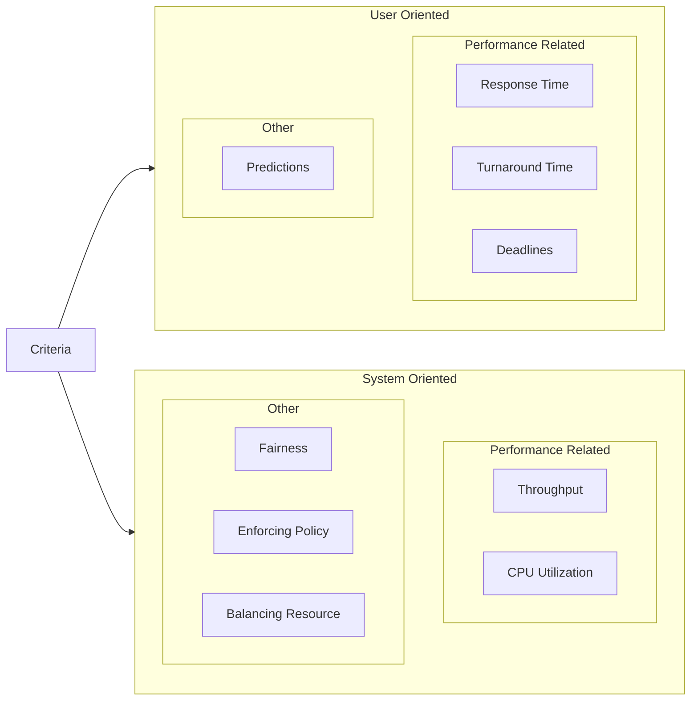

# Processor Scheduling

## Schedulers
1) long-term (admin)
	- runs less frequent
	- admits job to system
	- controls degree of multiprogramming (concurrency level)
	- puts processes on the ready queue
2) medium-term (swap/suspend)
	- figure out who to suspend to disk (and back)
3) short-term (dispatcher)
4) I/O scheduling

## Scheduling Algorithms

### Criteria

### Decision modes
- non preemptive
- preemptive

### Scheduling Polices
1) Priorities
	- starvation is possible (can fix by impl "aging")
2) FIFO
	- non preemptive
	- simple to impl
	- favors CPU bound vs. IO bound
3) round-robin
	- preemptive
	- uses a time-clock to generate quantums(slices)
4) shortest job first
	- non preemptive
	- aka. shortest process next
	- run until process gives up CPU (finish, block, etc.)
5) shortest remaining time
	- preemptive
	- aka. shortest remaining time
	- run until a shorter process arrives

#### FIFO example
|Process|Arrival Time|Service Time(TS)|Start Time|Finish Time|Turnaround Time(TE)|TE/TS|
|---|---|---|---|---|---|---|
|A|0|1|0|1|1|1|
|B|1|100|1|101|100|1|
|C|2|1|101|102|100|100|
|D|3|100|102|202|199|1.99|

#### Process time for interactive jobs
- keep average "burst time"
	- ti = processor execution tiem for ith instance of process
	- si = predicted value for ith instance
	- s1 = predicted value for 1st instance
$$
S_{n+1} = \frac1n \sum_{i=1}^n T_i
= \frac1n[t_1+t_2+\dots+t_n]
= \frac1n T_n + \frac{n-1}n S_n
$$

exponential averaging
$$
S_{n+1} = \alpha T_n + (1-\alpha) S_n \space|\space 0\lt\alpha\lt1
$$

##### Gantt Charts

|Proc|Burst|Arrival Time|
|---|---|---|
|P1|24|0|
|P2|3|1|
|P3|3|2|

```mermaid
gantt
	dateFormat s
	axisFormat %S
	title Process schedule
	P1 :a, 0, 24s
	P2 :b, after a, 3s
	P3 :c, after b, 3s
```

$$\text{avg wait time}: \frac{P1+P2+P3}3= \frac{0+23+25}3 = \frac{48}3 = 16$$
