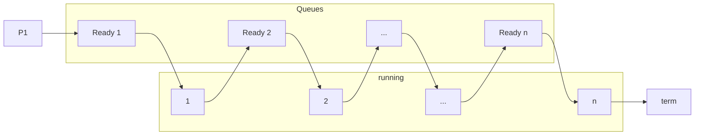

# Gantt Charts (cont.)

## SJF non-preemptive

### example 1
| Proc | Burst | Arr |
| ---- | ----- | --- |
| P1   | 6     | 0   |
| P2   | 8     | 0   |
| P3   | 7     | 0   |
| P4   | 3     | 0   |

```mermaid
gantt
	dateFormat s
	axisFormat %S
	title Process schedule
	P1 :a, 0, 6s
	P2 :b, after a, 8s
	P3 :c, after b, 7s
	P4 :d, after c, 3s
```

$$\text{avg wait}: \frac{3+16+9+0}4 = 7$$
$$\text{avg turnaround-time}: \frac{9+24+16+3}3 = 13$$

### example 2

| Proc | Burst | Arr |
| ---- | ----- | --- |
| P1   | 8     | 0   |
| P2   | 4     | 1   |
| P3   | 9     | 2   |
| P4   | 5     | 3   |

```mermaid
gantt
	dateFormat s
	axisFormat %S
	title Process schedule
	P1 :a, 0, 8s
	P2 :b, after a, 4s
	P4 :c, after b, 5s
	P3 :d, after c, 9s
```

## SJF preemptive

| Proc | Burst | Arr |
| ---- | ----- | --- |
| P1   | 8=1+7 | 0   |
| P2   | 4     | 1   |
| P3   | 9     | 2   |
| P4   | 5     | 3   |

```mermaid
gantt
	dateFormat s
	axisFormat %S
	title Process schedule
	P1 :a, 0, 1s
	P2 :after a, 4s
	P4 :c, after b, 5s
	P1 :d, after c, 7s
	P3 :after d, 9s
```

$$\text{avg wait}: \frac{9+0+15+2}4 = 6 \frac12$$
$$\text{avg turnaround-time}: \frac{17+4+24+7}4 = 13$$

## Round Robin

Q=4

| Proc | Burst | Arr |
| ---- | ----- | --- |
| P1   | 24    | 0   |
| P2   | 3     | 0   |
| P3   | 3     | 0   |

```mermaid
gantt
	dateFormat s
	axisFormat %S
	title Process schedule
	P1 :a, 0, 4s
	P2 :b, after a, 3s
	P3 :c, after b, 3s
	P1 :d, after c, 4s
	P1 :e, after d, 4s
	P1 :f, after e, 4s
	P1 :g, after f, 4s
	P1 :h, after g, 4s
```

- at time 4
	- P1 goes from Running to Ready (context switch)
	- P2 starts
- at time 14, P1 continues (no context switch)

## Highest Response Ration Next (HRRN)

normalized turnaround-time

$$\frac{t_z}{TS} = \frac{\text{turnaround time}}{\text{service time}}$$

if w = time spent waiting
S = expected service time
response ration = (w+s)/s

| Proc | Arr | Burst |
| ---- | --- | ----- |
| A    | 0   | 1     |
| B    | 1   | 9     |
| C    | 2   | 1     |
| D    | 3   | 9     | 

```mermaid
gantt
	dateFormat s
	axisFormat %S
	title Process schedule
	A :a, 0, 1s
	B :b, after a, 9s
	C :c, after b, 1s
	D :after c, 9s
```

### calculation to schedule C or D
$$RR_c = \frac{8+1}1=9$$
$$RR_d = \frac{7+9}9=1.77777$$

## Multilevel (feedback) queues
*multiple ready queues*

