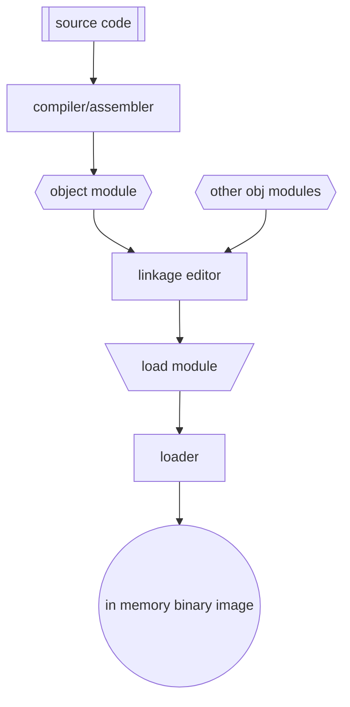
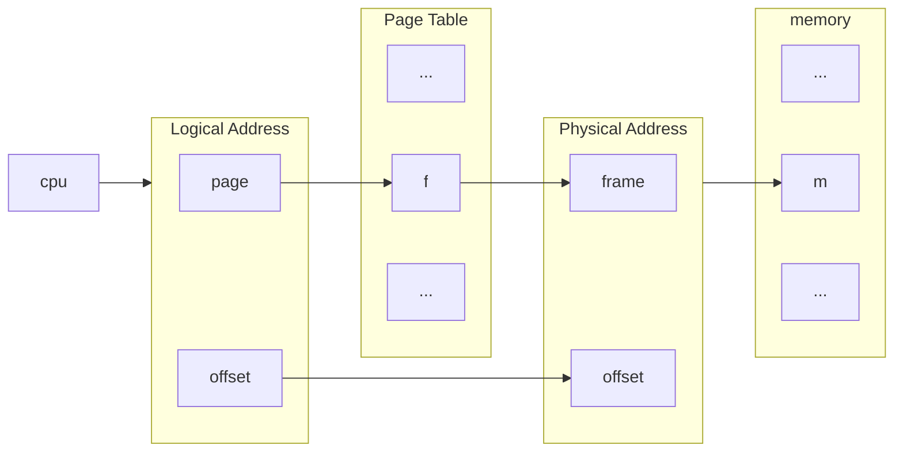

# Memory Management
- Fetch-Decode-Execute Cycle
- memory sees only a stream of addresses

## Address Binding
physical addresses have to be binded to the logical addresses in the program



> [!info] Memory should handle
> 1) Relocation
> 2) Protection
> 3) Sharing
> 4) Logical orgainization
> 5) Physical organization

## Logical vs Physical address
- logical: addr generated by CPU
- pysical: addr in memory
- MMU (memory mgmt unit) binds logical to physical

## Memory partitioning
- assume entire process must be in main memory
- assume entire process is stored contiguously
1) fixed partitioning
	- divide memory into static partitions
	- equal sized partitions
		- process is given whole partition
		- what is left in the partition is wasted (internal fragmentation)
	- un-equal size partitions
		- need a placement algorithm
		1) first fit (or next fit, which starts from last placed process)
		2) best fit (available or overall-wait)
3) Dynamic Partitioning
	- give a process exactly what it needs dynamically
	- can end up with external fragmenation
		- process needs space, which is available, but not contiguous
		- can do garbage collection to fix, but this is an expensive operation
	- still need placement algorithm
		1) first/next fit
		2) best fit (can lead to lots of small external fragmenations)
		3) worst fit

### example
assume holes/pockets in order of 100k, 500k, 200k, 300k, 600k
processes: 212k, 417k, 112k, 426k
1) First Fit - cannot finish
	- 212k -> 500k (288k)
	- 417k -> 600k (183k)
	- 112k -> 288k (176k)
	- 426k -> --no place--
2) Next fit - cannot finish
	- 212k -> 500k (288k)
	- 417k -> 600k (183k)
	- 112k -> 183k (71k)
	- 426k -> --no place--
3) Best fit - finish, but lots of small pockets
	- 212k -> 300k (88k)
	- 417k -> 500k (83k)
	- 112k -> 200k (88k)
	- 426k -> 600k (174k)
4) Worst fit - still cannot finish, but larger pockets
	- 212k -> 600k (388k)
	- 417k -> 500k (83k)
	- 112k -> 388k (276k)
	- 426k -> --no place--

> [!warning] Memory will become full
> we need a pick a victem to swap out
> need a replacement algorithm

## Dynamic-Static Partitioning (Buddy system)
1) start with one block of 2^u
2) request for size R if 2^u-1 < R < 2^u, entire block is allocated
3) else: block is halved: 2 blocks of size 2^u-1
4) if 2^u-2 < R < 2^u-1, request is allocated 1 2^2 block (these 2 blocks are buddies)
5) otherwise, split one buddy in halve again (continue until have smallest block >= R)
*once 2 buddies are both free, they get rejoined into one block*

[1024]
request 70k
[70k|128k|256k|512k]
request 35k
[70k+|35k+|64k|256k|512k]
request 80k
[70k+|35k+|64k|80k+|128k|512k]
release 35k
[70k+|128k|80k+|128k|512k]
release 70k
[256k|80k+|128k|512k]

#### example2
start: 16k(free)
request A: 3.6k
[4k(A)|4k(free)|8k(free)]
request B: 1.5k
[4k(A)|2k(B)|2k(free)|8k(free)]
request C: 1.2k; D: 1.9k; E: 2.7k
[4k(A)|2k(B)|2k(C)|2k(D)|2k(free)|4k(E)]
free C alloc
[4k(A)|2k(B)|2k(free)|2k(D)|2k(free)|4k(E)]
free B alloc
[4k(A)|4k(free)|2k(D)|2k(free)|4k(E)]
request: F: 1.5k; G: 1.6k
[4k(A)|2k(G)|2k(free)|2k(D)|2k(F)|4k(E)]
d is freed
[4k(A)|2k(G)|2k(free)|2k(free)|2k(F)|4k(E)]
a is freed
[4k(free)|2k(G)|2k(free)|2k(free)|2k(F)|4k(E)]
g is freed
[8k(free)|2k(free)|2k(F)|4k(E)]

```mermaid
gantt
	dateFormat s
	axisFormat %S
	title Example 2

	section Start
		16k(free) :a, 0, 16s

	section req A (3.6k)
		4k(A) :a, 0, 4s
		4k(free) :b, after a, 4s
		8k(free) :c, after b, 8s

	section req B (1.5k)
		4k(A) :a, 0, 4s
		2k(B) :b, after a, 2s
		2k(free) :c, after b, 2s
		8k(free) :d, after c, 8s

	section req C (1.2k), req D (1.9k), req E (2.7k)
	section free C
	section free B

	section req F (3.6k), req G (1.6k)
		4k(A) :a, 0, 4s
		2k(G) :b, after a, 2s
		2k(free) :c, after b, 2s
		2k(free) :d, after c, 2s
		2k(F) :e, after d, 2s
		4k(E) :f, after e, 4s
		
	section free D
	section free A
	section free G

	section req H (6.8k), free E, req I (850bytes)

	section req J (610bytes), req K (1.6k), L (750b), free H

	section req M (3.9k), req N (1.7k), free L, free F
```


> [!idea]
> divide memory into fixed size chunks (called pages)
> 
> **pages** are what a process is divided into
> **page frames** are what memory is divided into
> **page table** maps logical pages to physical frames


1) load 4 pages of A
2) load 3 pages of B
3) load 4 pages of C
4) B finishes
5) load 5 pages of D
	- need 5 but don't have 5 contiguous
	- can split store pages non-contiguously if we have a page table

| index | page frame | page table A | Page table C | Page Table D |
|  --- | ----------- | ------------ | ------------ | ------------ |
|   0  | A.0         |      0       |      7       |      4       |
|   1  | A.1         |      1       |      8       |      5       |
|   2  | A.2         |      2       |      9       |      6       |
|   3  | A.3         |      3       |     10       |     11       |
|   4  | ~~B.0~~ D.0     |              |              |     12       |
|   5  | ~~B.1~~ D.1     |              |              |              |
|   6  | ~~B.2~~ D.2     |              |              |              |
|   7  | C.0         |              |              |              |
|   8  | C.1         |              |              |              |
|   9  | C.2         |              |              |              |
|  10  | C.3         |              |              |              |
|  11  | D.3         |              |              |              |
|  12  | D.4         |              |              |              |

> [!info] page table
> **logical address**: page#, offset --> **physical addr**: frame#, offset
> *every process must have a page table*

## example:
- 8 page frames
- 4 bytes each frame
- 32 bytes -> 5bit addr [page#:3|offset:2]
...picture...

logical address 7 (h in program)
[1|11] -> [111|11]



```plantuml
	map PageTableA {
		0 => 6
		1 => 3
		2 => 4
		3 => 1
	}

	map MM {
		0 =>
		1 => A.3
		31 =>
	}
	
```

page: 16bytes (2^4)

logical address(0x2C): [2|4] = [10|1100] (page 2 -> frame 4)
physical address: [5|4] = [00100|1100] = 0x4C

logical address(0x3F): [2|4] = [11|1111] (page 3 -> frame 1)
physical address: [5|4] = [00001|1111] 
