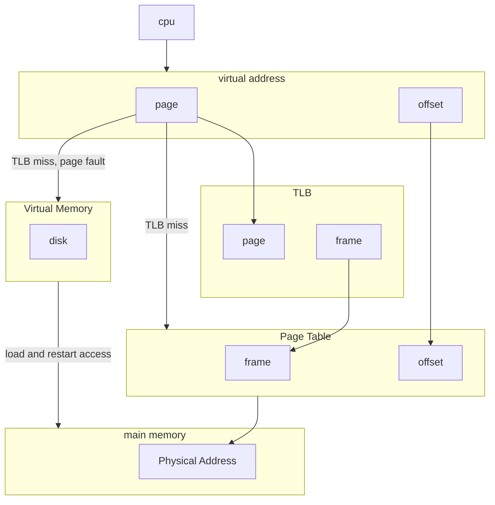

# Virtual Memory

- allows only part of the program in main memory
- page table adds a present/absent column (bit)
- adds control bits column
- some OS's provide a modify bit to indicate page has changed in memory

| id  | Frame | P/A | CB  |
| --- | ----- | --- | --- |
| 0   | 6     |  1  |     |
| 1   | -     |  0  |     |
| 2   | 7     |  1  |     |
| 3   | -     |  0  |     |
| 4   | 1     |  1  |     |
| 5   | 5     |  1  |     |

- page fault: when P/A is 0 and page needs to be pulled from virtual memory
- requires good locality of reference to work well
- need a good replacement algorithm to pick a page to evict when MM is full
- ==lookup hatfield diagram==

## Page fault handling
1) start with reference (logical address) and try to dereference in page table
2) not in memory, so OS puts process in a blocked state (await missing page)
3) OS find's page on disk
4) bring page into main memory
5) update page table
6) restart access

**thrashing**: when a page is brought into main memory and then thrown out before it can be used

> [!info] 2-level page table
> used when page table is too large to fit in main memory
> logical address: [P1|P2|offset]
> P1: index in outer table
> P2: index in inner table

## inverted page table
- 1 page table for the whole system
- 1 entry for each page frame
	- page number
	- process id
	- control bits...
- need to use hashing (with chaining for collisions), otherwise we have to search whole table for page

## Caching the page table
### **TLB**: translation lookaside buffer
- associative memory
- stores page frame pairs

# example
- main memory: 200ns
- TLB: 20ns
- secondary memory: 20ms (fetch, update PT, update TLB)
- TLB hitrate: 85%
- page fault rate: 5%
- cache: 30ns
- cache hitrate: 98%
*assume cache and main memory searches overlap*
*assume a TLB search and a PT search do not overlap*

## TLB hit
$$EAT = [\text{TLB hit}] + [\text{TLB miss}] + [\text{page fault}]$$
$$EAT=.85(20ns + .98(30)+.02(200ns))+.15(20ns+200ns+.95(.98(30ns)+.02(200ns)) + .05(20ms + 20ns + 200ns))$$
$$EAT=.85(20ns + .98(30)+.02(200ns))+.15(20ns+200ns+.95(.98(30ns)+.02(200ns)) + .05(20ms + 20ns + 200ns))$$
