# OS
## Key Elements
- OS
	- Service Call handler
		- Service call from process
	- Interupt handler
		- int from proc
		- int from I/O (hardware)
	- long term scheduler
		- queue of processes
	- short term scheduler
		- queue of processes
		- scheduler itself (dispatcher)
			- picks a process
			- passes control to process
			- pass control to a selected process

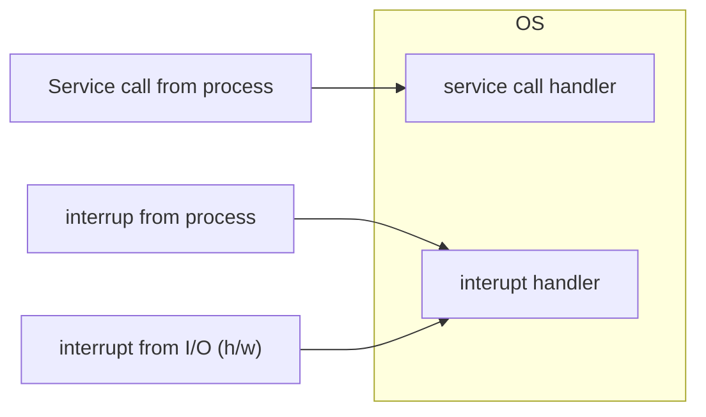

## Modes
- user mode
	- task operating on behalf of user
- kernel mode (supervisor, protected, controlled)
	- access a special subset of instructions & special registers
	- has complete control of hardware

*user mode -> kernel mode via hardware interrupt or software trap/exception*

## Services
## System calls
- interface to services of the OS
- API (winapi, POSIX, etc.)
- Types
	- process control
	- file mgmt
	- dev mgmt
	- info maintenance
	- communication (i.e. shell pipe)

Windows | Unix
--- | ---
CreateProcess()|fork()
ExitProcess()|exit()
WaitForSingleObject()|wait()
CreateFile()|open()
...|...

## OS structure
1) Monolithic
2) Microkernel
3) Layered
	1) h/w
	2) kernel
	3) system call interface
	4) unix commands & libraries
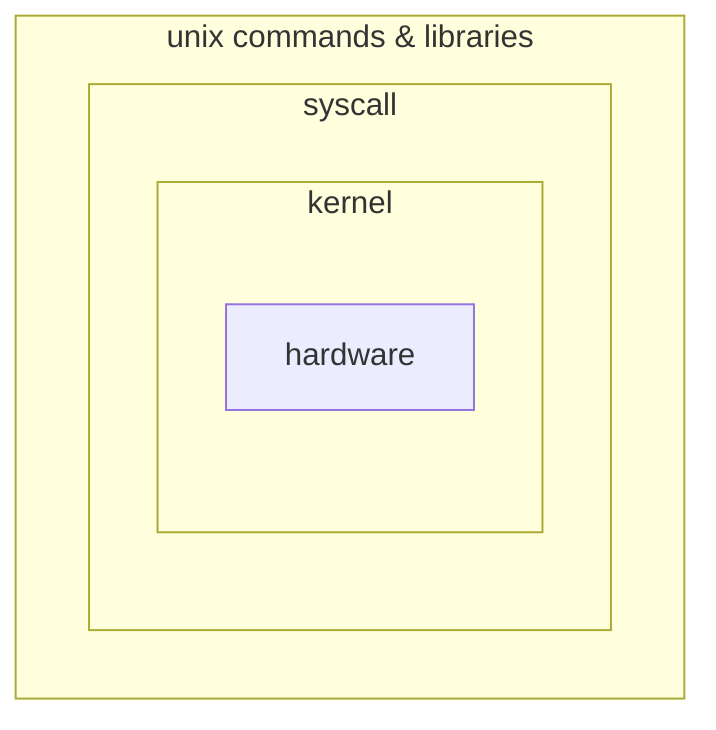

## Process management
- multiple processes running "concurrently"

#### Time flow
*dispatcher does not need state saved/restored (it has its own special registers)*
- A1-A4 running
- D1-D5 (dispatcher) (context switch)
	- save state
	- select process to run
	- restore new process's state
- B1-... running
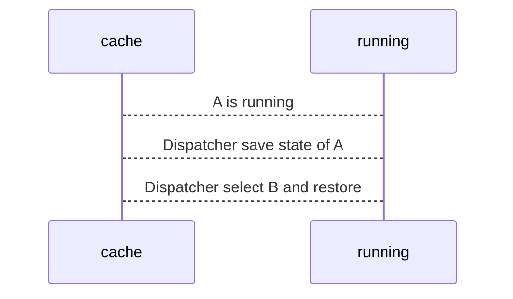

##### Process State
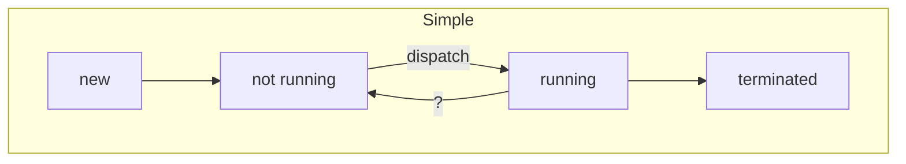
? state (is it waiting on I/O? is it ready to run?)

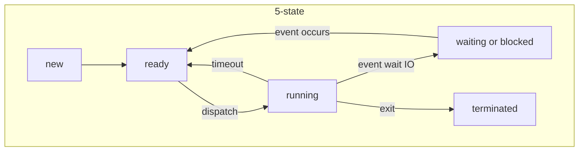

suspending: additional state to swap waiting processes out of memory
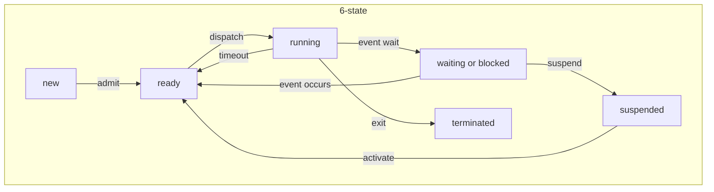

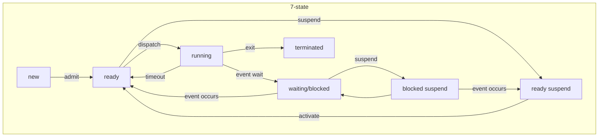

## Process Status Tables
1) Memory tables
2) I/O tables
3) File tables
4) Process tables

- Main table with each entry pointing to its appropriate status table
- each entry (process ID) in a status table points to a process image
- _Process Image_- complete physical manifestation of a process (in a stack)
	- code
	- data
	- stack
	- [[PCB]] - state of the process

example:
```
+------+
|prog N|
|prog 2|
|prog 1|
| sys  |
|  os  |
+------+
```
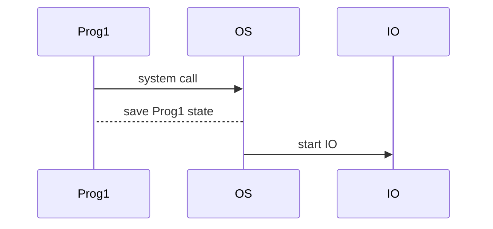

### Unix Process Example
- unix syscalls in example
	- fork
	- wait
	- exit
	- exec

logical address space
```
0------+
| text |
| data |
| heap |
\ .... \
|stack |
max----+
```

```plantuml
object "logical address space" as l {
	text
	----
	data
	----
	heap
	----
	...
	----
	stack
}
```
#### fork
- constructs a new logical address space and context for child that are identical to the parent
	- clones data, heap, and stack segment
	- code segment: cloned or shared
	- registers are identical -> program counter is identical
- returns different values in the parent and the child
	- child gets a return value of 0
	- parent gets the childs PID as the return value

##### example
```c
#include <stdio.h> // printing
#include <unistd.h> // fork syscall
#Include <wait.h> // wait syscall

int main() {
	printf("Parent running\n");
	int pid = fork();

	if (pid != 0) {
		// parent: do parent stuff
		printf("Parent running after fork\n");
		wait(null); // wait until child is finished
		printf("Parent done\n");
	}

	else {
		// child: do child stuff
		printf("Child running\n");
		sleep(5);
		printf("Child done\n");
	}
}
```

#### WAIT
- `wait(int *status)` causes parent to wait on any **one** of its children
- `wait(NULL)` (no status)
#### Exit
- `exit(int rv)`: causes program to exit the main method, returning specified `rv`
#### exec
- `execl`
- `execv(prog, [*args])`
- `execvp`
- `[*args]` must end with `NULL` (`["ls", "-l", NULL]`)
- transforms the calling process into a new process
- program counter is set to the start of the new program
- {process, parent process} ID does not change

## Process Trees
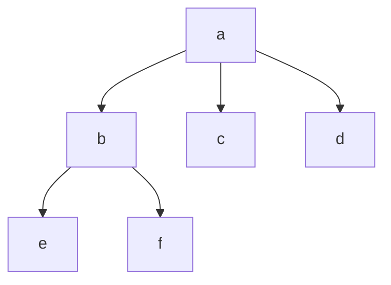

for assigments
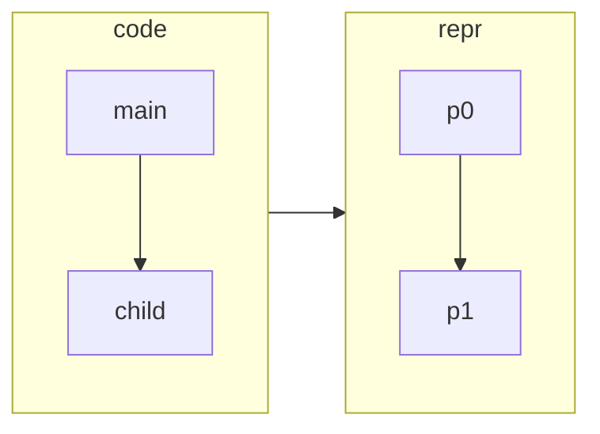
### example
```c
int main() {
	printf("foo\n");
	fork();
	printf("bar\n");
	fork();
	printf("!!\n");
}
```

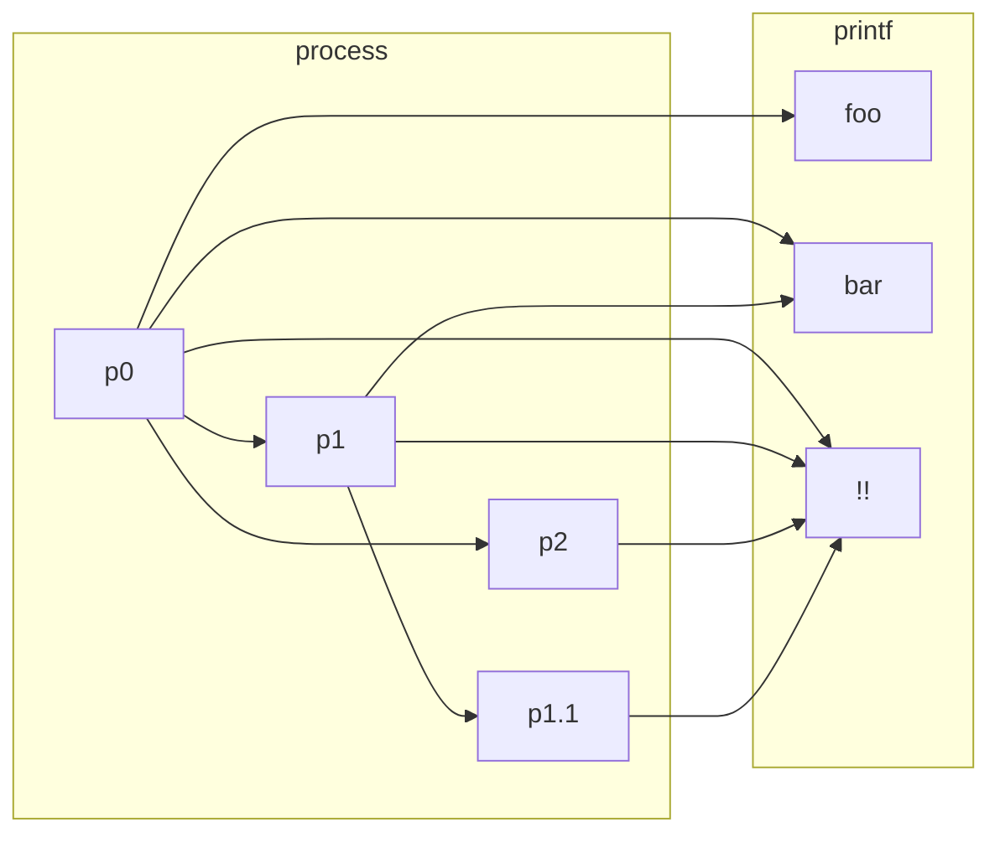

```c
int main() {
	for (int i-1; i<4; i++) {
		printf("i is %d\n", i);
		fork();
	}
	
	return 0;
}
```

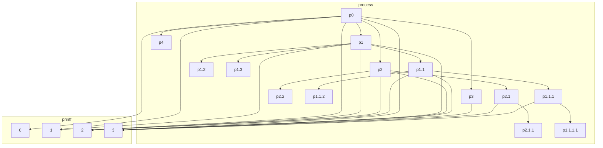

```c
int main() {
	int child = fork();
	int c = 5;
	if (child == 0) {
		c = c + 5;
	}

	else {
		child = fork();
		c = c + 10;

		if (child != 0) {
			c = c + 5;
		}
	}
}
```

```plantuml
map p0 {
	child => --int1--, int2
	c => --5--, --15--, 20
}

map p1 {
	child => 0
	c => --5--, 10
}

map p2 {
	child => 0
	c => --5--, 15
}

p0 --> p1
p0 --> p2
```

#### Zombie process
- process that has terminated whose parent never calls `wait`
- child is only removed from process table by `wait` syscall

#### orphan process
- child whose parent has been terminated
- given to the init process
