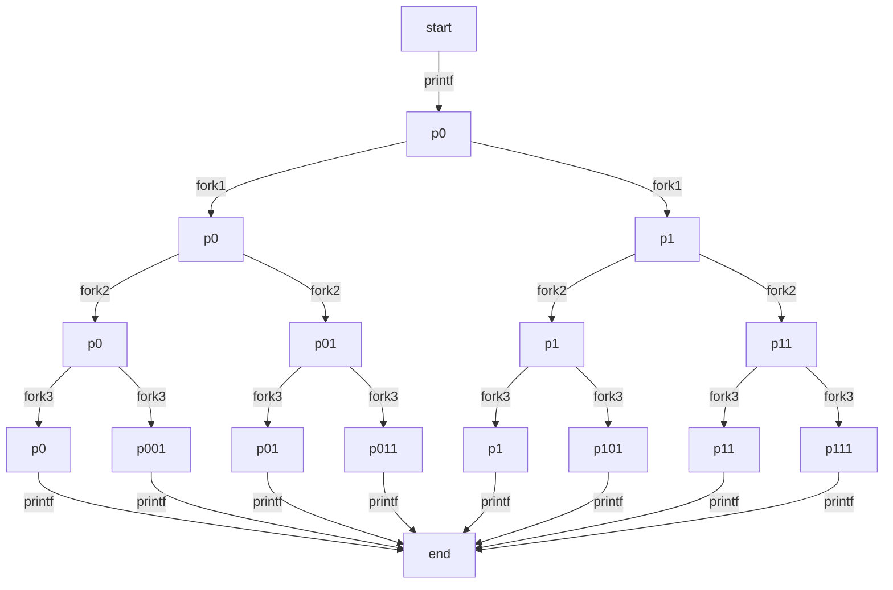
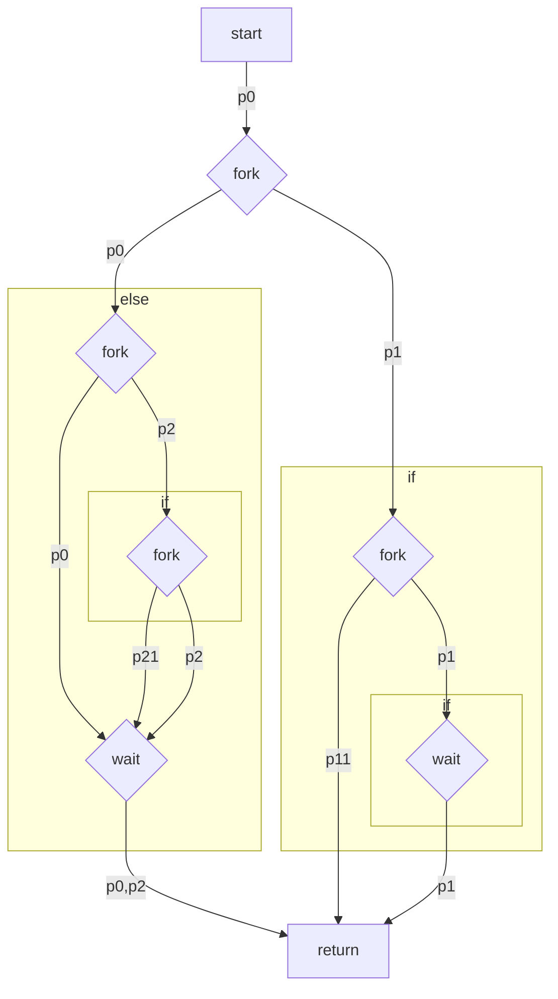
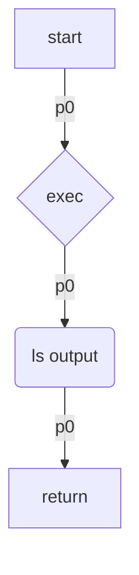

Patrick Miller

# 1)
1) new
2) ready
3) running
4) waiting or blocked
5) ready
6) running
7) waiting or blocked
8) ready
9) running
10) terminated

- first `printf` is at steps 3-6
- second `printf` is at steps 6-9

# 2)
|time|P1|P2|P3|P4|
|---|---|---|---|---|
|12|blocked waiting|blocked waiting|ready,running|blocked waiting|
|23|ready,running,terminated|ready,running,terminated|blocked suspend|blocked waiting|
|27|ready,running,terminated|ready,running,terminated|ready suspend|blocked waiting|

# 3)
A = 2103, since `fork()` gives the parent the child's pid
B = 1179, since `getpid()` will return the parent's pid (executed within the parent's context)
C = 0, since `fork()` gives the child 0
D = 2103, since `getpid()` will return the child's pid (executed within the child's context)

# 4)
TGIF is printed 9 times

# 5)

a) the code produces 5 processes during execution
b) no zombie processes are created because all parent processes call `wait()`
c) since this is before any forks, this would replace the entire program with a call to `ls`, as such

