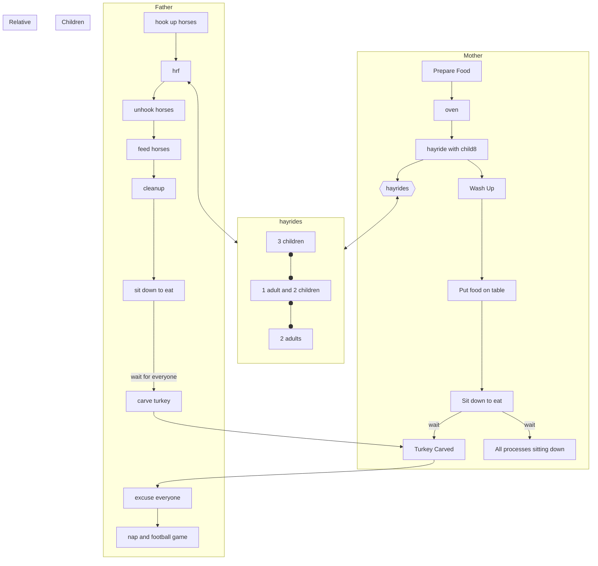

```mermaid
flowchart TD
	turkey_carved[Turkey Carved]

	subgraph hayrides
		direction TB
		
		a[3 children] o--o b[1 adult and 2 children] o--o c[2 adults]
	end
	hrm <--> hayrides
	hrf <--> hayrides
	
	subgraph Mother
		direction TB
		
		foodprep[Prepare Food] --> oven --> hr[hayride with child8]
		hr --> hrm{{hayrides}}
		hr --> washup[Wash Up] --> foodtable[Put food on table]
		foodtable --> sd_m[Sit down to eat]
		sd_m -->|wait| sd_all[All processes sitting down]
		sd_m -->|wait| turkey_carved
	end
	
	subgraph Father
		h1[hook up horses] --> hrf --> h2[unhook horses]
		h2 --> fh[feed horses] --> cl_f[cleanup]
		cl_f --> sd_f[sit down to eat]
		sd_f -->|wait for everyone| carve[carve turkey] --> turkey_carved
		turkey_carved --> exc[excuse everyone] --> nap[nap and football game]
	end
	
	subgraph Children
		
	end
	
	subgraph Relative
		
	end
```
